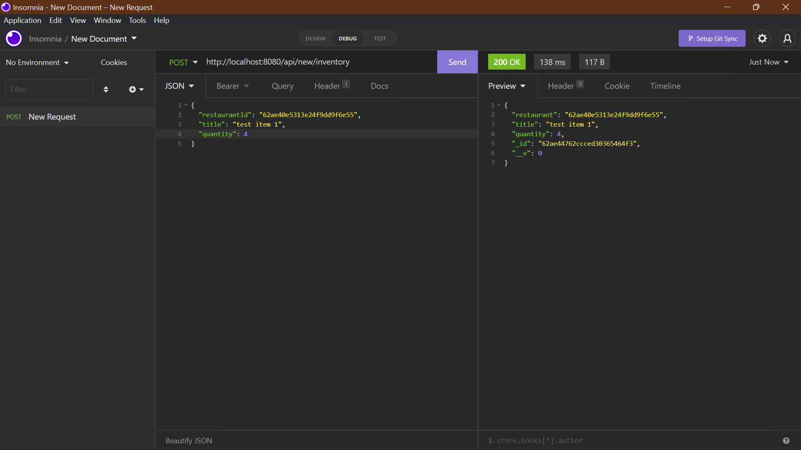

# API Usage Guide

# Restaurant

- Get all Restaurant: _/api/_

  

- Register New Restaurant: _/api/new/restaurant_

  

- Login as Restaurant: _/api/login_

  

# Inventory Items

- Get Inventory of a Restaurant: _/api/inventory/:restaurantId_

  

- Set Inventory Item for a Restaurant: _/api/new/inventory_

  

- Update Inventory of a Restaurant: _/api/update/:id_
  - Example 1:

    
  
  - Example 2:

    
